# 1. Prepration

Preview the data

```
CPU Data: 2348 rows, 28 columns
GPU Data: 618 rows, 13 columns
Full Relation Data: 1959 rows, 70 columns
```

# 2. Data Analasys

## 2.1 CPU Dataframe

### 2.1.1 Preview the data

#### Dataframe head

```
                    name performance_clockspeed performance_turbospeed  \
0   intel core i3 1315ue                   1.20                   4.50
1     intel core i3 n300                   None                   3.80
2    intel core i3 1305u                   1.60                   4.50
3      amd ryzen 3 7320u                   2.40                   4.10
4  intel core i5 1038ng7                   2.00                   3.80

   performance_cores  performance_threads efficient_clockspeed  \
0                2.0                  4.0                 None
1                8.0                  8.0                 None
2                1.0                  2.0                 1.20
3                4.0                  8.0                 None
4                4.0                  8.0                 None

  efficient_turbospeed  efficient_cores  efficient_threads    tdp  ...  \
0                 3.30              4.0                4.0  15.00  ...
1                 None              NaN                NaN   7.00  ...
2                 3.30              4.0                4.0  15.00  ...
3                 None              NaN                NaN  15.00  ...
4                 None              NaN                NaN  28.00  ...

   eff_l2_cache  integer_math floating_point_math find_prime_numbers  \
0          None       34537.0             20958.0               51.0
1          None       29169.0             19343.0               22.0
2   1 x 2048 kb       27950.0             20052.0               36.0
3          None       29638.0             14121.0               20.0
4          None       27545.0             15238.0               28.0

  random_string_sorting data_encryption data_compression physics  \
0               10759.0          6321.0         103162.0   824.0
1               12797.0          7034.0         100731.0   516.0
2               10623.0          6021.0          95060.0   518.0
3               13922.0          6266.0         131689.0   437.0
4               11471.0          5714.0         109286.0   698.0

  extended_instructions  single_thread
0                5172.0           3269
1                5174.0           2122
2                5262.0           3276
3                5905.0           2378
4                6539.0           2152

[5 rows x 28 columns]
```

#### Dataframe tail

```
                                name performance_clockspeed  \
2343                     intel u300e                   1.10
2344  arm huawei,kunpeng 920 24 core                   2.60
2345             amd custom apu 0932                   2.40
2346            intel core i7 10710u                   1.10
2347            intel core i3 1125g4                   2.00

     performance_turbospeed  performance_cores  performance_threads  \
2343                   4.30                1.0                  2.0
2344                   None               24.0                 24.0
2345                   3.50                4.0                  8.0
2346                   4.70                6.0                 12.0
2347                   3.70                4.0                  8.0

     efficient_clockspeed efficient_turbospeed  efficient_cores  \
2343                 None                 3.20              4.0
2344                 None                 None              NaN
2345                 None                 None              NaN
2346                 None                 None              NaN
2347                 None                 None              NaN

      efficient_threads    tdp  ...  eff_l2_cache  integer_math  \
2343                4.0  15.00  ...   1 x 2048 kb       30218.0
2344                NaN   None  ...          None       91062.0
2345                NaN  15.00  ...          None       28027.0
2346                NaN  15.00  ...          None       35167.0
2347                NaN  28.00  ...          None       29716.0

     floating_point_math find_prime_numbers random_string_sorting  \
2343             21589.0               45.0               11513.0
2344             30906.0               48.0               40681.0
2345             17049.0               23.0               14366.0
2346             21715.0               31.0               16853.0
2347             18257.0               34.0               12839.0

     data_encryption data_compression physics extended_instructions  \
2343          6421.0          98379.0   599.0                5279.0
2344          2447.0          94224.0   822.0               10829.0
2345          7582.0         117043.0   613.0                6566.0
2346          3269.0         128017.0   642.0                8051.0
2347          5666.0         107758.0   577.0                7990.0

      single_thread
2343           3546
2344            733
2345           2263
2346           2336
2347           2476

[5 rows x 28 columns]
```

#### Check all the features

```
Index(['name', 'performance_clockspeed', 'performance_turbospeed',
       'performance_cores', 'performance_threads', 'efficient_clockspeed',
       'efficient_turbospeed', 'efficient_cores', 'efficient_threads', 'tdp',
       'multithread_rating', 'single_thread_rating', 'l1_instruction_cache',
       'l1_data_cache', 'l2_cache', 'l3_cache', 'eff_l1_instruction_cache',
       'eff_l1_data_cache', 'eff_l2_cache', 'integer_math',
       'floating_point_math', 'find_prime_numbers', 'random_string_sorting',
       'data_encryption', 'data_compression', 'physics',
       'extended_instructions', 'single_thread'],
      dtype='object')

```

#### Check the data types and non-null counts

```
RangeIndex: 2348 entries, 0 to 2347
Data columns (total 28 columns):
 #   Column                    Non-Null Count  Dtype
---  ------                    --------------  -----
 0   name                      2348 non-null   object
 1   performance_clockspeed    2338 non-null   object
 2   performance_turbospeed    926 non-null    object
 3   performance_cores         2259 non-null   float64
 4   performance_threads       2259 non-null   float64
 5   efficient_clockspeed      129 non-null    object
 6   efficient_turbospeed      115 non-null    object
 7   efficient_cores           163 non-null    float64
 8   efficient_threads         163 non-null    float64
 9   tdp                       1441 non-null   object
 10  multithread_rating        2348 non-null   int64
 11  single_thread_rating      2348 non-null   int64
 12  l1_instruction_cache      1409 non-null   object
 13  l1_data_cache             1407 non-null   object
 14  l2_cache                  1405 non-null   object
 15  l3_cache                  868 non-null    object
 16  eff_l1_instruction_cache  103 non-null    object
 17  eff_l1_data_cache         103 non-null    object
 18  eff_l2_cache              93 non-null     object
 19  integer_math              2149 non-null   float64
 20  floating_point_math       2149 non-null   float64
 21  find_prime_numbers        2012 non-null   float64
 22  random_string_sorting     2149 non-null   float64
 23  data_encryption           1155 non-null   float64
 24  data_compression          2149 non-null   float64
 25  physics                   2149 non-null   float64
 26  extended_instructions     2149 non-null   float64
 27  single_thread             2348 non-null   int64
dtypes: float64(12), int64(3), object(13)
memory usage: 513.8+ KB
```

**Key Observations**:
- Most Non-Null Count columns appear to have complete data with non-null counts equal to
the total number of rows, indicating no missing data for those attributes.
- Any column with a non-null count less than the total row count has missing values, requiring
further exploration and potential handling.
**Conclusion**:
- The dataset is well-structured, with most columns having complete data and appropriate
data types.
- The clear distinction between numerical and categorical data allows for efficient analytical
and modeling workflows.

#### Look at descriptive statistics

```
       performance_cores  performance_threads  efficient_cores  \
count        2259.000000          2259.000000       163.000000
mean            4.544046             5.947764         6.791411
std             2.801395             4.002537         2.879159
min             1.000000             1.000000         2.000000
25%             2.000000             4.000000         4.000000
50%             4.000000             4.000000         8.000000
75%             8.000000             8.000000         8.000000
max            32.000000            32.000000        16.000000

       efficient_threads  multithread_rating  single_thread_rating  \
count         163.000000         2348.000000           2348.000000
mean            6.957055         5056.670358           1393.641823
std             3.081906         7341.559596           1016.341297
min             2.000000           93.000000             95.000000
25%             4.000000          840.500000            568.000000
50%             8.000000         2168.500000           1086.500000
75%             8.000000         5709.250000           1951.250000
max            16.000000        57389.000000           4786.000000

        integer_math  floating_point_math  find_prime_numbers  \
count    2149.000000          2149.000000         2012.000000
mean    21716.518381         11977.772918           24.540258
std     25417.697425         18214.180379           48.549368
min       122.000000           166.000000            1.000000
25%      5139.000000          1985.000000            5.000000
50%     13523.000000          4760.000000           10.000000
75%     25358.000000         12910.000000           23.250000
max    209791.000000        131787.000000          619.000000

       random_string_sorting  data_encryption  data_compression      physics  \
count            2149.000000      1155.000000       2149.000000  2149.000000
mean             9679.062355      6004.123810      73248.829688   367.891112
std             10193.531835      6337.221465      90040.342566   519.354517
min               294.000000      1025.000000       2023.000000    14.000000
25%              2917.000000      1869.000000      18278.000000    93.000000
50%              5869.000000      3258.000000      38372.000000   184.000000
75%             12586.000000      7656.500000      90448.000000   415.000000
max             81685.000000     43769.000000     719086.000000  6476.000000

       extended_instructions  single_thread
count            2149.000000    2348.000000
mean             3776.795254    1393.641823
std              6023.329546    1016.341297
min                25.000000      95.000000
25%               537.000000     568.000000
50%              1354.000000    1086.500000
75%              3514.000000    1951.250000
max             52490.000000    4786.000000

```

**Key Observations**:
- **Cores and Threads**: Wide range, indicating a mix of basic and high-performance CPUs.

- **Base Clock**: Averages around a moderate GHz value, with low variability, suggesting con-
sistency across CPUs.

- **Boost Clock**: Generally higher than Base Clock, reflecting CPUs’ peak performance capa-
bility.

- **Multithread Rating**: High variability, suggesting significant differences in performance
among CPUs.

- **Single Thread Rating**: Lower variability, indicating more consistent optimization for single-
threaded tasks.

- Large gaps between **Min** and **Max** values in columns like Cores, Boost Clock, and Multithread Rating highlight the diversity of CPUs in the dataset.

**Conclusion**: The descriptive statistics confirm the dataset captures a broad spectrum of CPU performance levels, making it suitable for analyses like performance clustering or segmentation.

### 2.1.2 Feature Analysis

#### Overall Performance Ratings

Features:
- `multithread_rating`, `single_thread_rating`

##### Distribution of ratings

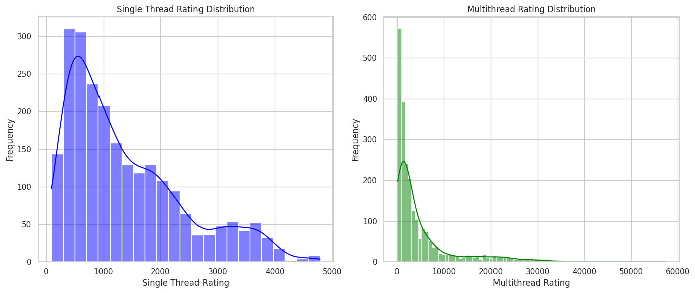

```
Single Thread Rating Statistics:
count    2348.000000
mean     1393.641823
std      1016.341297
min        95.000000
25%       568.000000
50%      1086.500000
75%      1951.250000
max      4786.000000
Name: single_thread_rating, dtype: float64

Multithread Rating Statistics:
count     2348.000000
mean      5056.670358
std       7341.559596
min         93.000000
25%        840.500000
50%       2168.500000
75%       5709.250000
max      57389.000000
Name: multithread_rating, dtype: float64
```

**Key Observations**:
- The **single_thread_rating** plot demonstrates a moderately skewed distribution, with the majority of CPUs clustered around lower-to-mid performance scores and a long tail of high-
performing CPUs.

- The **multithread_rating** distribution is more positively skewed, with a wider range and a
noticeable clustering of lower-performance CPUs.

**Conclusion**: Single-threaded performance ratings are generally more tightly distributed compared to multi-threaded ratings. This indicates that while most CPUs perform similarly on single-threaded tasks, there is significant variability in multi-threaded performance, likely due to differences in core and thread counts.

##### Single vs Multithreaded

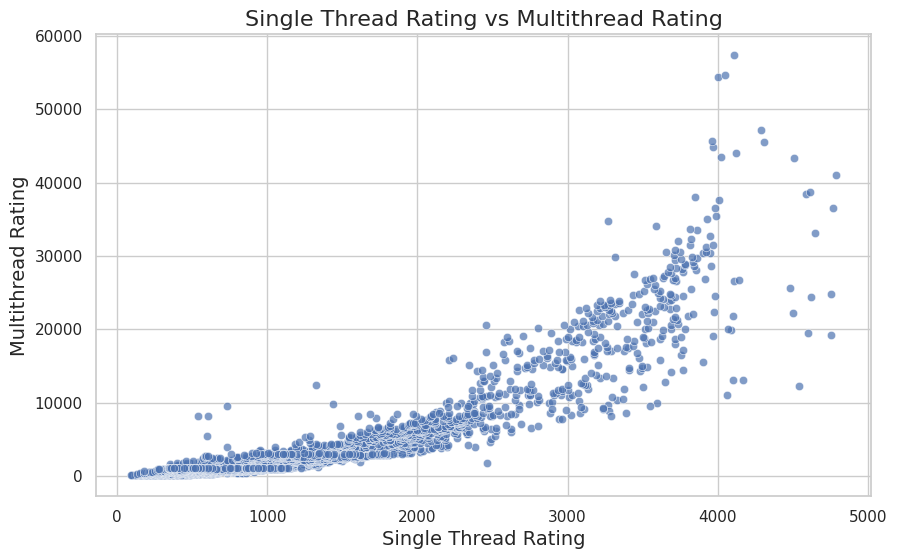

```
The correlation between single_thread_rating and multithread_rating is: 0.88
```

**Key Observations**:
- The scatter plot shows a strong positive linear relationship between **single_thread_rating** and **multithread_rating**, indicating that CPUs with high single-threaded performance typically also perform well in multi-threaded tasks.

- However, some outliers deviate from this trend, suggesting CPUs optimized for one workload
type over the other.

**Conclusion**:
- The correlation coefficient of 0.88 confirms a strong relationship between the two metrics.
- Outliers could represent specialized CPUs, such as those designed for specific workloads (e.g.,
gaming or server tasks).

#### Clockspeed metrics

Features:
- `performance_clockspeed`, `performance_turbospeed`
- `efficient_clockspeed`, `efficient_turbospeed`

##### Distribution

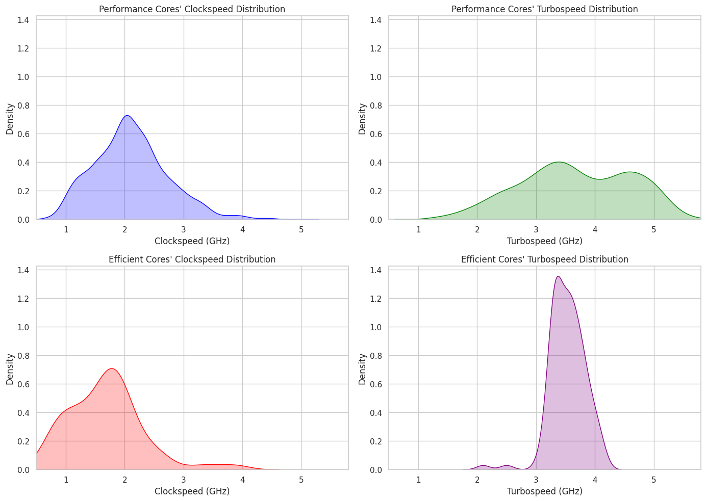

**Key Observations**:
- **Performance Cores**:
     - Their base and turbo speeds are more diverse, ranging from lower to higher values, indicating flexibility in handling tasks of varying intensity.
     - The bimodal distribution of turbo speeds suggests distinct groups of CPUs, possibly differentiated by generation or architecture.
- **Efficient Cores**:
     - Base clock speeds are significantly lower than those of performance cores, aligning with their energy-saving design.

     - Turbo speeds show less variability, with most values clustering in a narrow range, indicating consistent optimization for specific tasks.

**Conclusion**:
- Performance cores are designed for high variability in workloads, offering a broad range of clock and turbo speeds.
- Efficient cores prioritize power efficiency, with lower base clocks and a consistent turbo speed range.
- These distributions highlight the architectural differences between performance and efficient cores, aligning with their intended use cases in modern CPUs.

##### Correlation with Performance

```
Correlation between performance_clockspeed and single_thread_rating: 0.61
Correlation between performance_clockspeed and multithread_rating: 0.48
Correlation between efficient_clockspeed and single_thread_rating: 0.21
Correlation between efficient_clockspeed and multithread_rating: 0.14

```

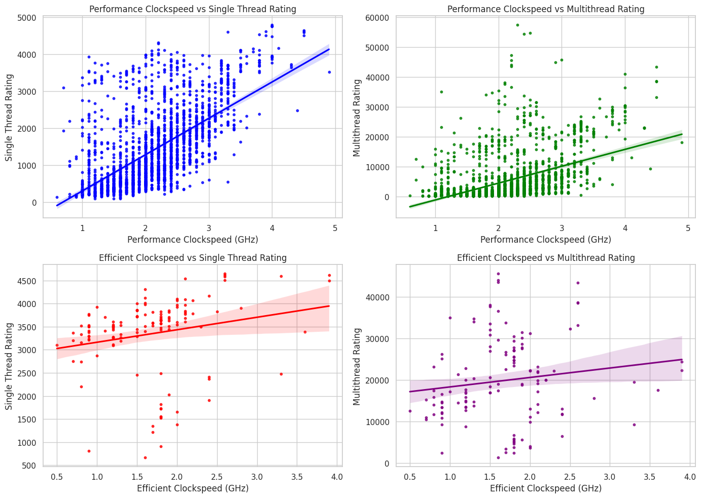

**Key Observations**:

- **Performance Clockspeed vs Single Thread Rating**:
     - The plot shows a strong positive linear relationship, reflecting the significant impact of performance clockspeed on single-threaded tasks.
     - The regression line aligns well with the data points, supporting the correlation value of 0.61.
- **Performance Clockspeed vs Multithread Rating**:
     - A positive trend is visible, but the data points are more spread out, indicating a weaker relationship compared to single-threaded performance.
     - The moderate correlation value of 0.48 aligns with the less pronounced regression line.
- **Efficient Clockspeed vs Single Thread Rating**:
     - A weak positive relationship is observed, as reflected by the loose clustering of data points around the regression line.
     - The correlation value of 0.21 confirms the limited impact of efficient clockspeed on single-threaded tasks.
- **Efficient Clockspeed vs Multithread Rating**:
     - The relationship is weak and scattered, with a slight positive trend.
     - The low correlation value of 0.14 reflects the minimal influence of efficient clockspeed
     on multithreaded performance.

**Conclusion**:
- **Performance Clockspeed** has a stronger influence on CPU performance, particularly for single-threaded tasks, and plays a moderate role in multithreaded performance.
- **Efficient Clockspeed**, designed for energy efficiency, contributes less significantly to both single-threaded and multithreaded ratings.
- The visualizations and regression lines validate the earlier numerical correlation

##### Boost impact

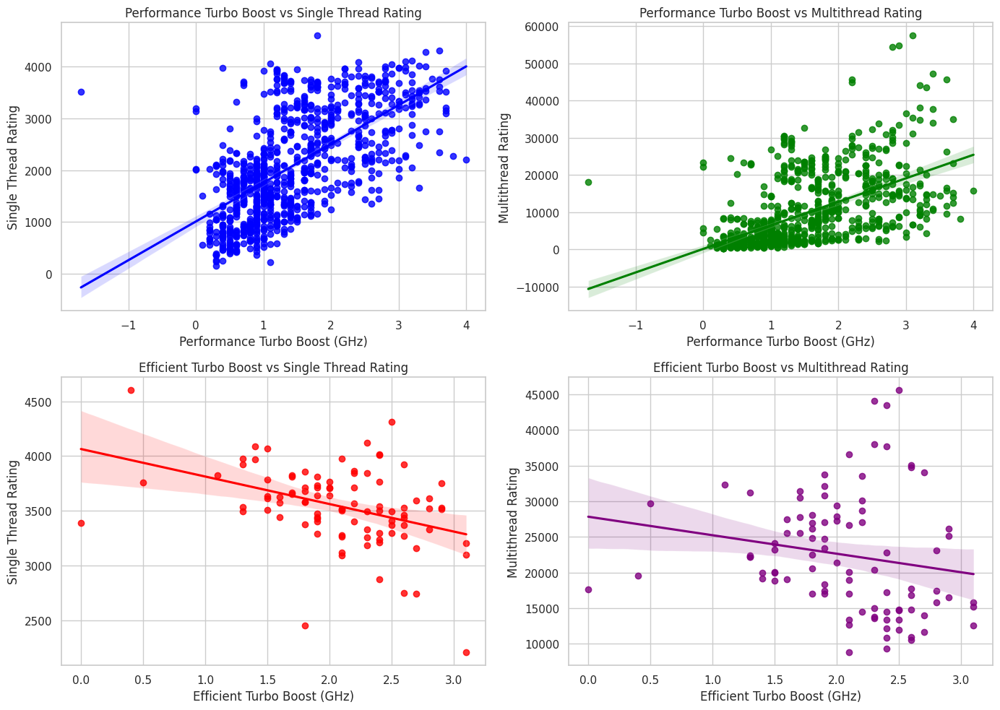

**Key Observations**:
- **Performance Turbo Boost vs Single Thread Rating**:
     - There is a strong positive linear relationship, indicating that higher performance turbo boost significantly improves single-threaded performance.
     - The regression line confirms this trend, suggesting a direct impact of turbo boost on peak single-thread performance.
- **Performance Turbo Boost vs Multithread Rating**:
     - A positive trend is observed, but the relationship is weaker compared to single-threaded performance.
     - The wider spread of data points around the regression line reflects the varying contribution of turbo boost to multithreaded workloads.
- **Efficient Turbo Boost vs Single Thread Rating**:
     - A weak negative relationship is observed, suggesting that increasing efficient core turbo boost has minimal or slightly negative effects on single-threaded performance.
     - This could indicate that efficient cores are not designed to excel in single-threaded tasks.
- **Efficient Turbo Boost vs Multithread Rating**:
     - A weak negative trend is visible, showing a limited or slightly adverse impact of efficient turbo boost on multithreaded performance.
     - The scatter suggests that efficient cores contribute to multithreaded workloads primarily through core count rather than clock speed.

**Conclusion**:

- **Performance Turbo Boost** significantly enhances single-threaded performance and moderately improves multithreaded workloads.

- **Efficient Turbo Boost** has minimal or slightly negative effects on both single-threaded
and multithreaded ratings, aligning with its energy-saving focus rather than performance optimization.
- These trends reinforce the distinct roles of performance and efficient cores, with performance cores being the primary drivers of high-performance tasks.

#### Core & Thread Analysis

Features:
- `performance_cores`, `performance_threads`
- `efficient_cores`, `efficient_threads`

##### Distribution

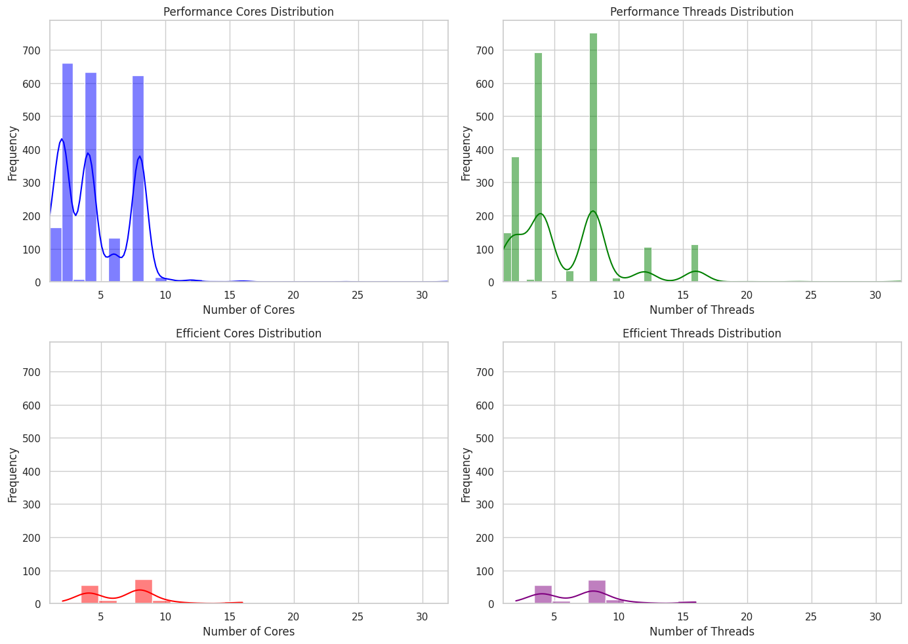

**Key Observations**:
- **Performance Cores Distribution**:
     - Most CPUs have 4, 6, or 8 performance cores, reflecting common configurations in mainstream and high-performance processors.
     - A few CPUs feature higher core counts (e.g., 16 or more), likely targeting specialized workloads.
- **Performance Threads Distribution**:
     - The number of threads for performance cores generally aligns with the core count but is slightly higher in some cases due to technologies like hyper-threading.
     - Similar to cores, most CPUs have 4 to 16 performance threads.
- **Efficient Cores Distribution**:
     - Efficient cores are less prevalent, with most CPUs featuring 4 to 8 cores.
     - High efficient core counts are rare, reflecting their secondary role in modern CPU architectures.

- **Efficient Threads Distribution**:
     - The number of threads for efficient cores closely matches the core count, as efficient cores typically do not support hyper-threading.
     - The distribution is concentrated around 4 to 8 threads.

**Conclusion**:
- **Performance Cores** dominate in terms of variability and presence across CPU models, supporting their role as the primary contributors to computational performance.
- **Efficient Cores** are designed for energy efficiency, with smaller counts and thread numbers, complementing performance cores.
- The distributions highlight the architectural differences between performance and efficient cores, which align with their intended roles in hybrid CPU designs.

```
Performance Core/Thread Ratio Frequencies:
performance_core_thread_ratio
0.5     774
1.0    1485
Name: count, dtype: int64

Efficient Core/Thread Ratio Frequencies:
efficient_core_thread_ratio
0.5      4
1.0    159
Name: count, dtype: int64

```

**Key Observations**:
- **Performance Core/Thread Ratio**:
     - The majority of CPUs have a core/thread ratio of 1.0 (1484 instances), meaning each core corresponds to one thread. This indicates that these CPUs do not utilize hyper-threading technology.
     - A significant portion of CPUs have a ratio of 0.5 (773 instances), where each core
     supports two threads. These CPUs leverage hyper-threading or similar technologies to
     double the thread count.
- **Efficient Core/Thread Ratio**:
     - The majority of efficient cores have a core/thread ratio of 1.0 (158 instances), indicating that efficient cores typically operate without hyper-threading.
     - Only a small fraction (4 instances) have a ratio of 0.5, reflecting rare cases where efficient cores might support two threads per core.

**Conclusion**:
- **Performance Cores**: Hyper-threading is common but not universal, with many CPUs using a 1:1 core-to-thread mapping for simpler architectures or energy-efficient designs.
- **Efficient Cores**: Almost exclusively operate on a 1:1 core-to-thread ratio, reinforcing their design focus on simplicity and energy efficiency.
- The frequency distribution aligns with the architectural goals of performance and efficient cores in modern CPUs, where hyper-threading is prioritized for performance tasks.

##### Multi-threading impact

```
Correlation between performance_cores and multithread_rating: 0.41
Correlation between performance_threads and multithread_rating: 0.74
Correlation between efficient_cores and multithread_rating: 0.47
Correlation between efficient_threads and multithread_rating: 0.49

```

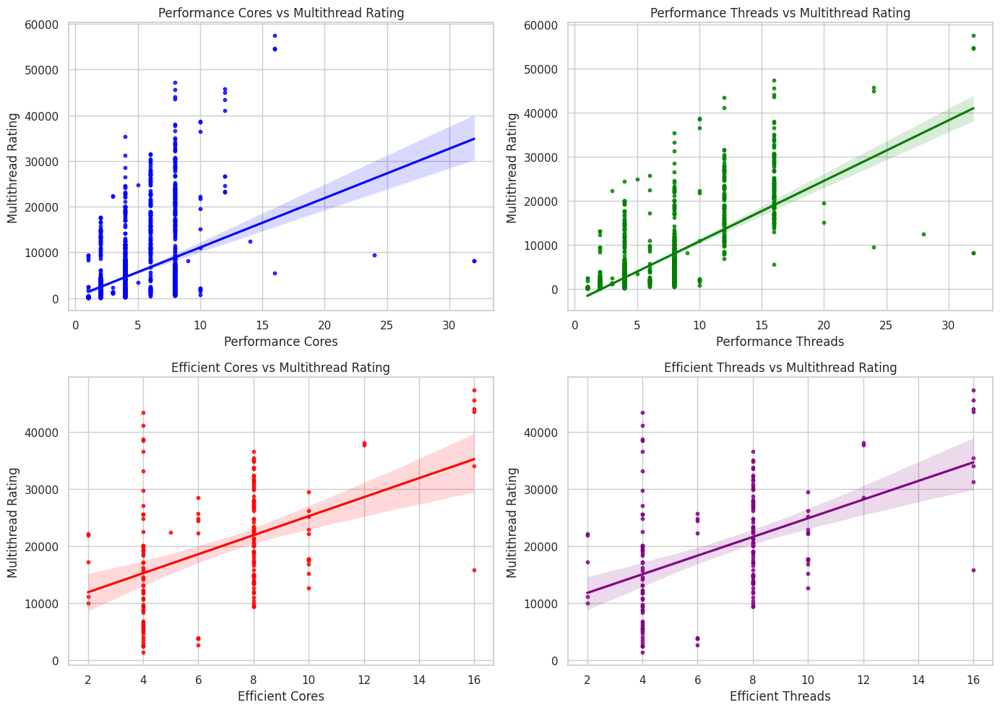

**Key Observations**:
- placeholder

**Conclusion**:
- placeholder

#### Power Consumption (TDP)

Features:
- `TDP`

##### TDP vs Performance

```
Correlation between TDP and single_thread_rating: 0.39
Correlation between TDP and multithread_rating: 0.43

```

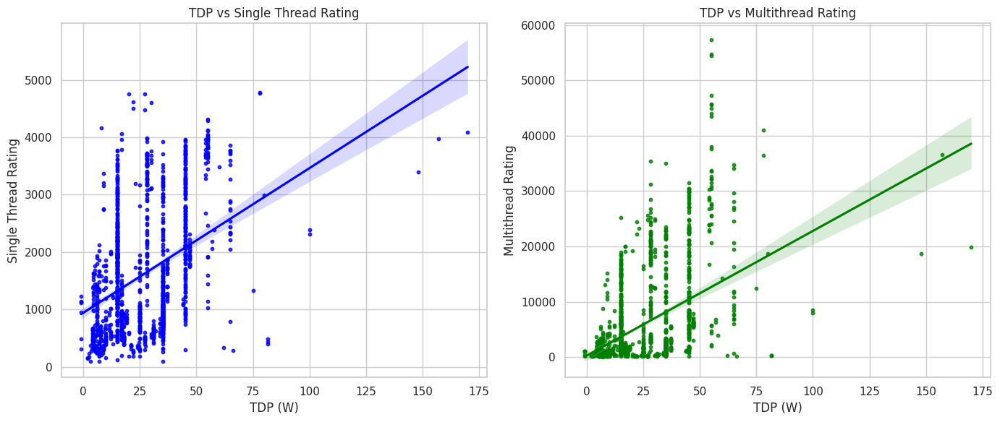

**Key Observations**:
- placeholder

**Conclusion**:
- placeholder

##### Efficiency Analysis

```
Top 5 rows:
                        name  multithread_rating   tdp  performance_efficiency
117  intel core ultra 7 164u               15187   9.0             1687.444444
470     amd ryzen z1 extreme               25182  15.0             1678.800000
82             apple a18 pro               13063   8.0             1632.875000
91       intel core i7 1260u               14001   9.0             1555.666667
52       intel core i7 1250u               11673   9.0             1297.000000

Bottom 5 rows:
                             name  multithread_rating   tdp  \
735  mobile amd athlon xp-m 1800+                 193  45.0
980    mobile amd athlon 64 3400+                 333  81.5
974    mobile amd athlon 64 3200+                 326  81.5
671            intel celeron b710                 106  35.0
681  mobile intel celeron 1.80ghz                 121  66.1

     performance_efficiency
735                4.288889
980                4.085890
974                4.000000
671                3.028571
681                1.830560

```

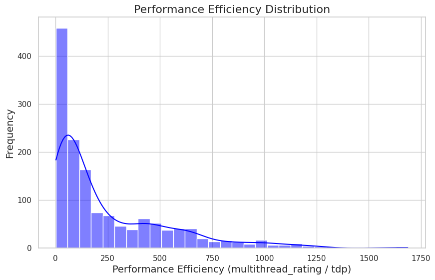

**Key Observations**:
- placeholder

**Conclusion**:
- placeholder

## 2.2 GPU Dataframe

### 2.2.1 Preview the data

#### Dataframe head

```
                      name  avg_g3d_mark bus_interface  max_memory_size  \
0          radeon rx 6600m         13814   pcie 4.0 x8           8192.0
1      radeont rx 6850m xt         13848  pcie 4.0 x16          12288.0
2  rtx 1000 ada generation         14043          None              NaN
3           rtx a3000 12gb         14088          None              NaN
4         geforce rtx 4050         14433  pcie 4.0 x16           6144.0

   core_clock max_direct open_gl  max_tdp  test_directx_9  test_directx_10  \
0      2068.0       12_2     4.6    100.0           180.0             89.0
1      2321.0       12_2     4.6    165.0           144.0            106.0
2         NaN       None    None      NaN           179.0             74.0
3         NaN       None    None      NaN           169.0             88.0
4      1605.0       12_2     4.6    115.0           186.0             81.0

   test_directx_11  test_directx_12  test_gpu_compute
0            135.0             52.0            5752.0
1            166.0             59.0            5210.0
2            115.0             65.0            5471.0
3            115.0             65.0            5593.0
4            131.0             61.0            5943.0

```

#### Dataframe tail

```
                        name  avg_g3d_mark bus_interface  max_memory_size  \
613          radeon rx 7900m         22752          None              NaN
614  rtx 4000 ada generation         22962          None              NaN
615  rtx 5000 ada generation         24006          None              NaN
616         geforce rtx 4080         25076  pcie 4.0 x16          12288.0
617         geforce rtx 4090         27754  pcie 4.0 x16          16384.0

     core_clock max_direct open_gl  max_tdp  test_directx_9  test_directx_10  \
613         NaN       None    None      NaN           267.0            127.0
614         NaN       None    None      NaN           271.0            140.0
615         NaN       None    None      NaN           272.0            153.0
616      1860.0       12_2     4.6    150.0           286.0            161.0
617      1455.0       12_2     4.6    150.0           315.0            181.0

     test_directx_11  test_directx_12  test_gpu_compute
613            256.0             93.0            9297.0
614            224.0            100.0            9232.0
615            239.0            102.0            9553.0
616            248.0             96.0           11422.0
617            270.0            107.0           12650.0

```

#### Check all the features

```
Index(['name', 'avg_g3d_mark', 'bus_interface', 'max_memory_size',
       'core_clock', 'max_direct', 'open_gl', 'max_tdp', 'test_directx_9',
       'test_directx_10', 'test_directx_11', 'test_directx_12',
       'test_gpu_compute'],
      dtype='object')

```

#### Check the data types and non-null counts

```
<class 'pandas.core.frame.DataFrame'>
RangeIndex: 618 entries, 0 to 617
Data columns (total 13 columns):
 #   Column            Non-Null Count  Dtype
---  ------            --------------  -----
 0   name              618 non-null    object
 1   avg_g3d_mark      618 non-null    int64
 2   bus_interface     349 non-null    object
 3   max_memory_size   342 non-null    float64
 4   core_clock        309 non-null    float64
 5   max_direct        353 non-null    object
 6   open_gl           346 non-null    object
 7   max_tdp           245 non-null    float64
 8   test_directx_9    340 non-null    float64
 9   test_directx_10   340 non-null    float64
 10  test_directx_11   340 non-null    float64
 11  test_directx_12   340 non-null    float64
 12  test_gpu_compute  340 non-null    float64
dtypes: float64(8), int64(1), object(4)
memory usage: 62.9+ KB
None

```

**Key Observations**:
- placeholder

**Conclusion**:
- placeholder

#### Look at descriptive statistics

```
       avg_g3d_mark  max_memory_size   core_clock     max_tdp  test_directx_9  \
count    618.000000       342.000000   309.000000  245.000000      340.000000
mean    2784.377023      2852.590643   756.132686   58.142857       64.752941
std     4605.472224      3298.820120   366.364012   38.361524       67.330367
min        2.000000         2.000000   143.000000    7.000000        1.000000
25%      358.000000       512.000000   500.000000   25.000000       11.000000
50%      671.500000      2048.000000   660.000000   50.000000       36.000000
75%     2697.000000      4096.000000   954.000000   80.000000      107.250000
max    27754.000000     16384.000000  2321.000000  165.000000      315.000000

       test_directx_10  test_directx_11  test_directx_12  test_gpu_compute
count       340.000000       340.000000       340.000000        340.000000
mean         26.597059        38.252941        19.311765       1892.626471
std          37.149137        51.488414        24.423437       2288.641490
min           0.000000         0.000000         0.000000          0.000000
25%           2.000000         4.000000         0.000000        239.500000
50%           7.000000        15.000000         7.500000        806.000000
75%          35.000000        54.000000        31.000000       2865.000000
max         181.000000       270.000000       107.000000      12650.000000

```

### 2.2.2 Feature Analysis

#### Clock Speed Analysis

Features:
- `core_clock`

##### Distribution

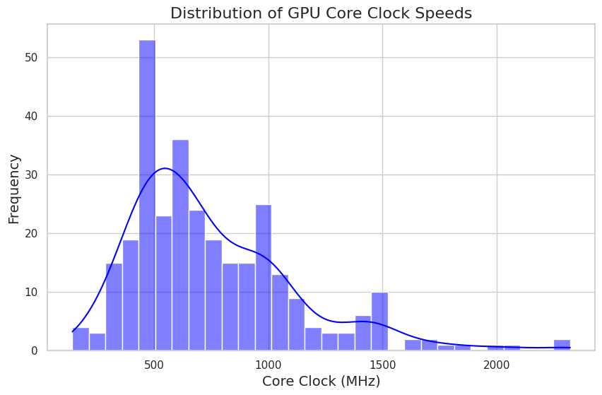

**Key Observations**:
- placeholder

**Conclusion**:
- placeholder

##### Impact on Performance

```
Correlation between core_clock and avg_g3d_mark: 0.71
Correlation between core_clock and test_directx_9: 0.70
Correlation between core_clock and test_directx_10: 0.63
Correlation between core_clock and test_directx_11: 0.68
Correlation between core_clock and test_directx_12: 0.70
Correlation between core_clock and test_gpu_compute: 0.68

```

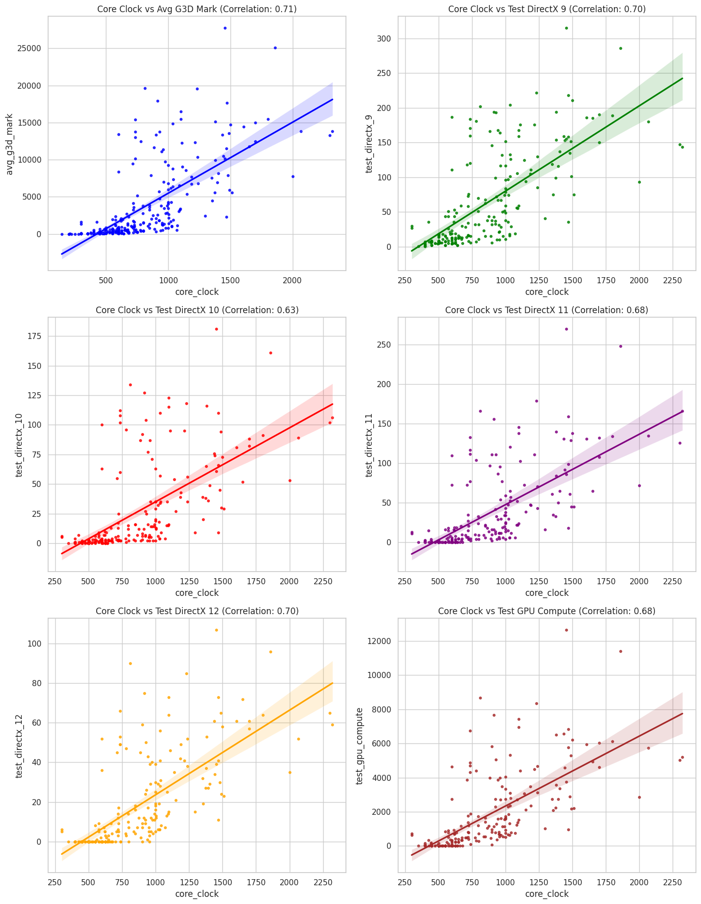

**Key Observations**:
- placeholder

**Conclusion**:
- placeholder

#### Memory and Bandwidth Analysis

Features:
- `max_memory_size`
- `bus_interface`

##### Memory Size

```
Unique categories in memory_size_comparison: Index(['2–4GB', '4–8GB', '8–16GB', '<2GB'], dtype='object', name='memory_size_category')
memory_size_category
<2GB        579.118182
2–4GB      3846.544118
4–8GB     11477.357143
8–16GB    16148.416667
Name: avg_g3d_mark, dtype: float64

```

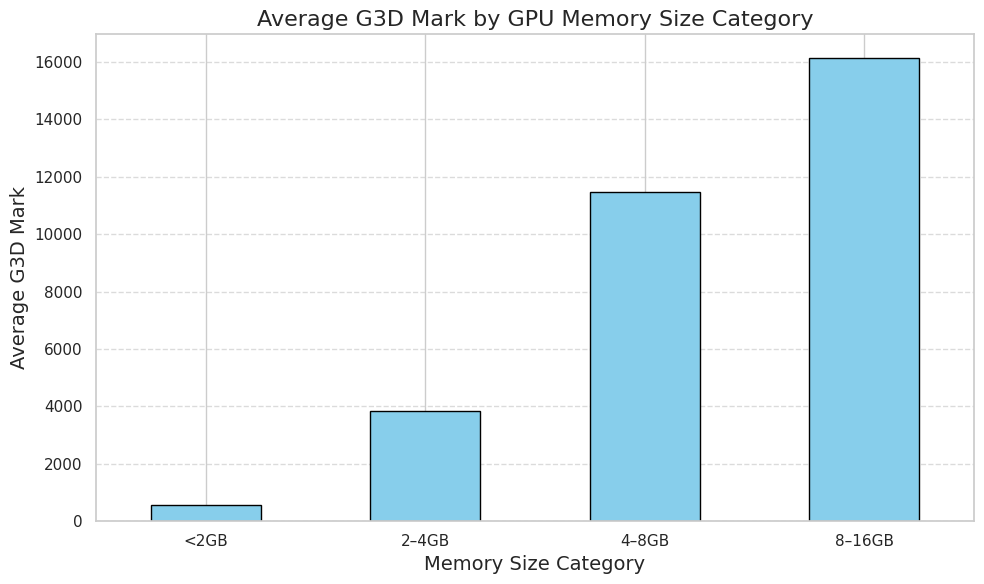

**Key Observations**:
- placeholder

**Conclusion**:
- placeholder

##### Bus Interface

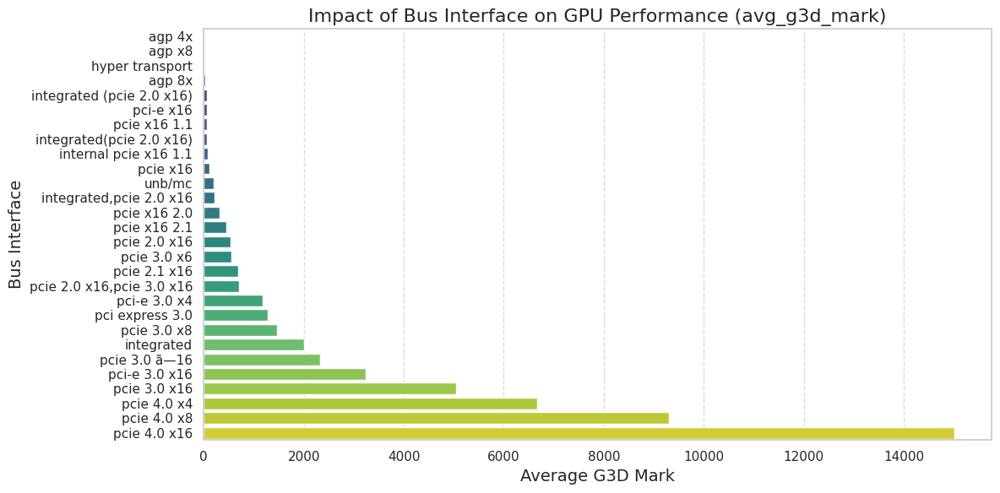

**Key Observations**:
- placeholder

**Conclusion**:
- placeholder

#### Power Consumption (TDP)

Features:
- `max_tdp`

##### Performance vs Power

```
Correlation between max_tdp and avg_g3d_mark: 0.75

```

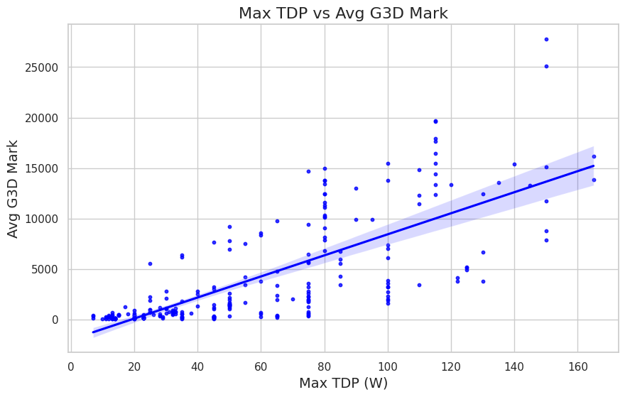

**Key Observations**:
- placeholder

**Conclusion**:
- placeholder

##### Efficiency

```
Top 5 GPUs by Efficiency:
                 name  avg_g3d_mark  max_tdp  efficiency
510  radeon pro w6300          5560     25.0  222.400000
591   radeon rx 7600s         14732     75.0  196.426667
593   radeon rx 6700s         14974     80.0  187.175000
617  geforce rtx 4090         27754    150.0  185.026667
556  radeon pro 5600m          9233     50.0  184.660000

Bottom 5 GPUs by Efficiency:
                    name  avg_g3d_mark  max_tdp  efficiency
103       radeon hd 6320           147     45.0    3.266667
121  geforce go 7800 gtx           210     65.0    3.230769
84        radeon hd 6310           122     45.0    2.711111
63        radeon hd 6250            94     35.0    2.685714
70        radeon hd 6290           105     45.0    2.333333

```

**Key Observations**:
- placeholder

**Conclusion**:
- placeholder

#### Overall Performance Ratings

Features:
- `avg_g3d_mark` (3DMark score)
- `test_gpu_compute` (compute performance)


##### Distribution of ratings


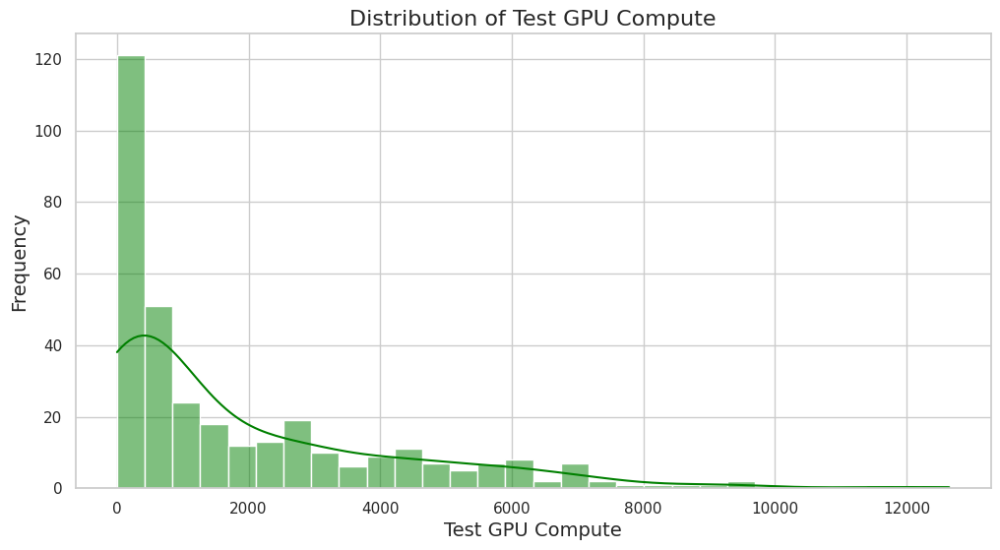

**Key Observations**:
- placeholder

**Conclusion**:
- placeholder

##### Compute vs Gaming

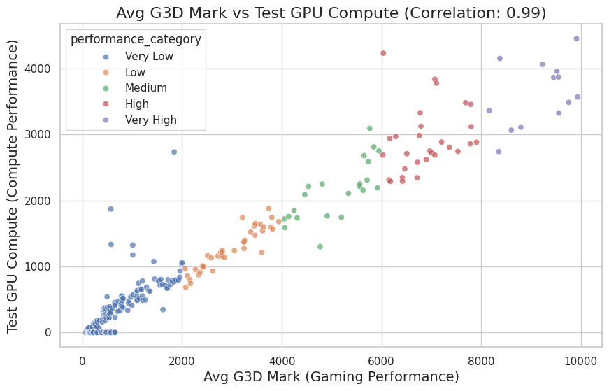

```
The correlation between avg_g3d_mark and test_gpu_compute is: 0.99
```

**Key Observations**:
- placeholder

**Conclusion**:
- placeholder

## 2.3 Full Laptop Dataframe

### 2.3.1 Source (Laptop Shop)

#### Analyzing number of laptops from each source

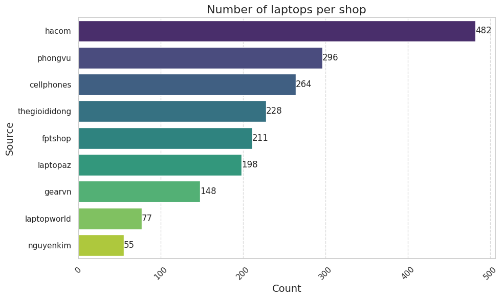

**Key Observations**:
- placeholder

**Conclusion**:
- placeholder

#### Analysising price grouped by source


**Key Observations**:
- placeholder

**Conclusion**:
- placeholder

```
                     count          mean           std         min  \
laptop_specs_source
cellphones           264.0  2.940125e+07  2.012227e+07   9490000.0
fptshop              211.0  2.747815e+07  1.818169e+07   9490000.0
gearvn               148.0  2.554818e+07  1.225296e+07  11990000.0
hacom                482.0  2.435385e+07  1.207721e+07   8799000.0
laptopaz             198.0  2.660227e+07  1.243102e+07  11990000.0
laptopworld           77.0  3.024714e+07  1.227698e+07  16290000.0
nguyenkim             55.0  1.755909e+07  5.782377e+06   9790000.0
phongvu              296.0  2.511128e+07  1.133528e+07   9490000.0
thegioididong        228.0  1.986680e+07  6.136243e+06   7890000.0

                            25%         50%         75%          max
laptop_specs_source
cellphones           17140000.0  23840000.0  34990000.0  182490000.0
fptshop              16490000.0  21990000.0  31440000.0  128990000.0
gearvn               18265000.0  22140000.0  25840000.0   89990000.0
hacom                16799000.0  21199000.0  29374000.0   95699000.0
laptopaz             17990000.0  23990000.0  30490000.0   85000000.0
laptopworld          21990000.0  27490000.0  34390000.0   88490000.0
nguyenkim            13640000.0  16790000.0  20990000.0   32990000.0
phongvu              17990000.0  21990000.0  27990000.0   83990000.0
thegioididong        16390000.0  18990000.0  22490000.0   70690000.0
```

**Key Observations**:
- placeholder

**Conclusion**:
- placeholder

### 2.3.2 Brand

#### Analysing number of laptops from each brand

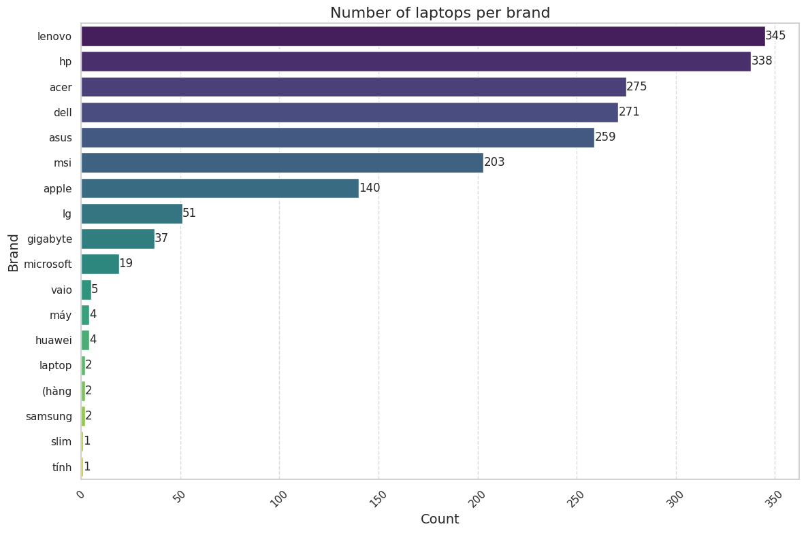

**Key Observations**:
- placeholder

**Conclusion**:
- placeholder

#### Analysising price grouped by brand

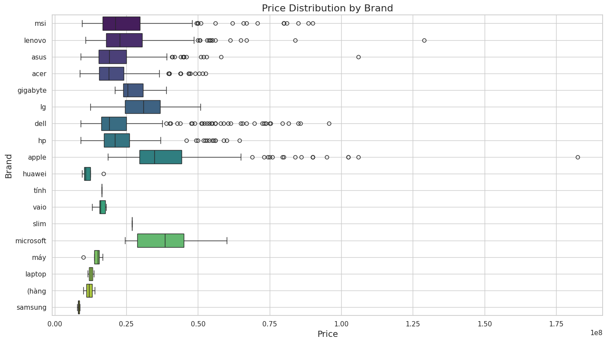

**Key Observations**:
- placeholder

**Conclusion**:
- placeholder

### 2.3.3 Central Processing Unit (CPU)

#### Basic analysis

```
Number of unique CPUs: 131

Top 10 CPUs by Mean Price:
                                  mean  count
laptop_specs_cpu
apple m3 max 16 core   138,740,000.00đ      2
apple m2 max 12 core   105,990,000.00đ      1
apple m4 max 16 core   102,490,000.00đ      2
intel core i9 13980hx   90,240,000.00đ      4
apple m4 max 14 core    86,656,666.67đ      3
intel core i9 13950hx   85,699,000.00đ      1
intel core i9 11900h    85,000,000.00đ      1
apple m3 max 14 core    82,490,000.00đ      5
intel core i7 13850hx   73,049,000.00đ      2
intel core i9 10885h    72,990,000.00đ      1


Bottom 10 CPUs by Mean Price:
                               mean  count
laptop_specs_cpu
amd ryzen 5 5500u    12,994,500.00đ      2
intel core 3 100u    12,990,000.00đ      1
intel core i3 1220p  12,490,000.00đ      1
amd ryzen 7 5700u    12,415,153.85đ     13
amd ryzen 5 7520u    12,104,454.55đ     22
intel core i3 1315u  11,889,387.10đ     31
intel core i3 8145u  11,640,000.00đ      2
intel core i3 1305u  11,531,272.73đ     11
intel core i3 1215u   9,968,217.39đ     23
intel celeron n4500   8,340,000.00đ      2


```

```
Top 10 CPUs by Count:
                                   mean  count
laptop_specs_cpu
intel core i5 13420h     18,797,554.62đ    119
intel core ultra 7 155h  34,566,491.53đ    118
intel core i5 1335u      17,550,769.91đ    113
intel core i7 13620h     23,585,819.82đ    111
intel core i7 1355u      21,408,989.80đ     98
intel core i5 1235u      15,204,220.78đ     77
intel core ultra 5 125h  24,521,516.13đ     62
intel core i5 1334u      16,736,633.33đ     60
intel core i5 12450h     17,077,685.19đ     54
apple m2 8 core          30,680,660.00đ     50


Bottom 10 CPUs by Count:
                                                    mean  count
laptop_specs_cpu
intel core i5 1230u                       24,490,000.00đ      1
intel core i7 1250u                       24,999,000.00đ      1
amd ryzen 7 4800h                         17,890,000.00đ      1
amd ryzen 7 6800h                         17,690,000.00đ      1
intel core i5 1345u                       24,999,000.00đ      1
intel core ultra 7 256v                   26,690,000.00đ      1
qualcomm snapdragon x elite - x1e-78-100  31,190,000.00đ      1
intel core ultra 7 165u                   31,490,000.00đ      1
intel core i5 11320h                      15,990,000.00đ      1
amd ryzen 7 5800hs                        23,990,000.00đ      1
```

**Key Observations**:
- placeholder

**Conclusion**:
- placeholder

#### Analyzing CPU performance relation with price

```
Correlation between multithread_rating and price: 0.57
Correlation between single_thread_rating and price: 0.50
```

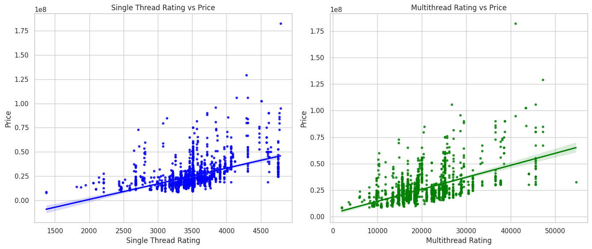

**Key Observations**:
- placeholder

**Conclusion**:
- placeholder

### 2.3.4 Graphics Processing Unit (GPU)

#### Basic analysis

```
Number of unique GPUs: 23

Top 10 GPUs by Mean Price:
                                   mean  count
laptop_specs_vga
geforce rtx 4090         93,490,000.00đ      4
geforce rtx 4080         76,677,500.00đ      8
rtx 2000 ada generation  75,153,571.43đ      7
geforce rtx 2060         55,990,000.00đ      1
rtx a1000                49,597,000.00đ      4
geforce rtx 4070         47,671,538.46đ     26
rtx a500                 47,532,333.33đ      3
geforce gtx 1650 ti      40,990,000.00đ      2
geforce rtx 3070 ti      37,490,000.00đ      1
geforce rtx 3060         35,521,900.00đ     10


Bottom 10 GPUs by Mean Price:
                            mean  count
laptop_specs_vga
geforce mx570     25,099,000.00đ      2
radeon rx 7600s   23,490,000.00đ      1
geforce mx450     22,994,500.00đ      2
geforce rtx 3050  22,533,222.89đ    166
geforce mx550     20,602,454.55đ     11
geforce rtx 2050  18,259,426.23đ     61
geforce mx250     18,190,000.00đ      1
geforce mx350     17,990,000.00đ      1
geforce gtx 1650  17,623,333.33đ      3
radeon rx 6550m   15,540,000.00đ      2


Top 10 GPUs by Count:
                                   mean  count
laptop_specs_vga
geforce rtx 3050         22,533,222.89đ    166
geforce rtx 4050         27,156,802.63đ    152
geforce rtx 4060         34,472,539.82đ    113
geforce rtx 2050         18,259,426.23đ     61
geforce rtx 4070         47,671,538.46đ     26
geforce mx550            20,602,454.55đ     11
geforce rtx 3050 ti      30,670,000.00đ     10
geforce rtx 3060         35,521,900.00đ     10
geforce rtx 4080         76,677,500.00đ      8
rtx 2000 ada generation  75,153,571.43đ      7


Bottom 10 GPUs by Count:
                               mean  count
laptop_specs_vga
geforce gtx 1650     17,623,333.33đ      3
geforce gtx 1650 ti  40,990,000.00đ      2
geforce mx570        25,099,000.00đ      2
geforce mx450        22,994,500.00đ      2
radeon rx 6550m      15,540,000.00đ      2
geforce rtx 3070 ti  37,490,000.00đ      1
radeon rx 7600s      23,490,000.00đ      1
geforce rtx 2060     55,990,000.00đ      1
geforce mx250        18,190,000.00đ      1
geforce mx350        17,990,000.00đ      1
```

**Key Observations**:
- placeholder

**Conclusion**:
- placeholder

#### Analyzing GPU performance relation with price

```
Correlation between avg_g3d_mark and price: 0.59
```

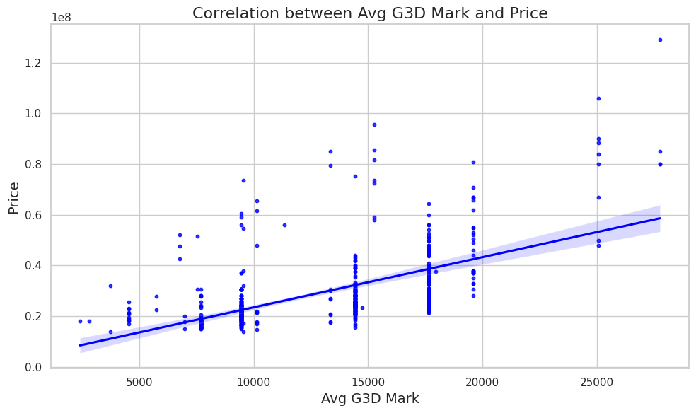

**Key Observations**:
- placeholder

**Conclusion**:
- placeholder

### 2.3.5 Random Access Memory (RAM)

#### Basic analysis

```
Unique RAM amounts and their counts:
laptop_specs_ram_amount
16.0     1202
8.0       459
32.0      182
24.0       46
4.0        19
12.0       16
36.0       14
64.0        9
48.0        4
18.0        4
96.0        1
128.0       1
Name: count, dtype: int64

Unique RAM types and their counts:
laptop_specs_ram_type
ddr5    1043
ddr4     752
Name: count, dtype: int64
```

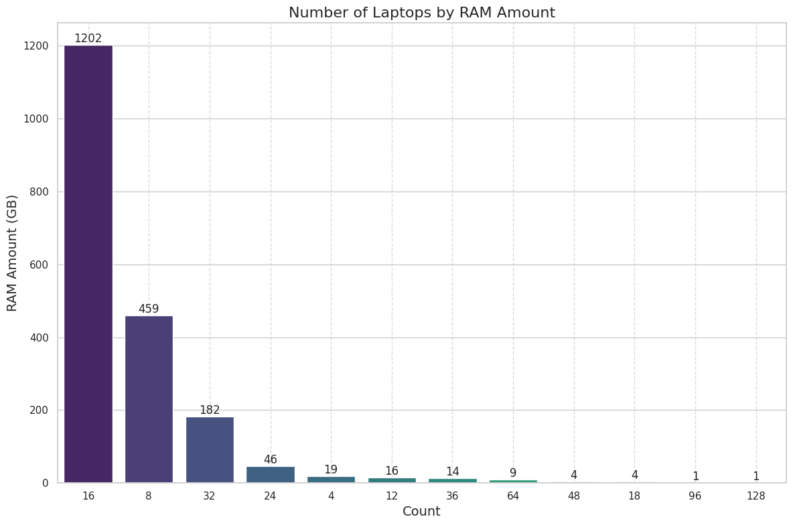

**Key Observations**:
- placeholder

**Conclusion**:
- placeholder

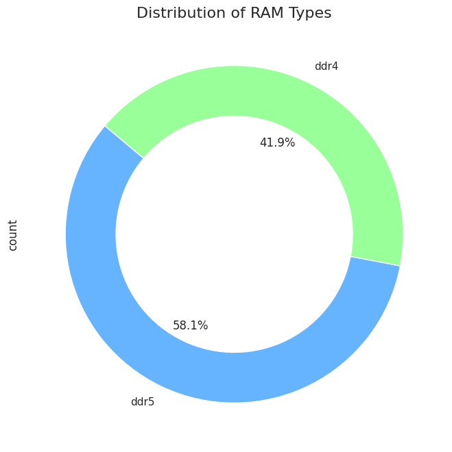

**Key Observations**:
- placeholder

**Conclusion**:
- placeholder

#### Analyzing RAM performance relation with price

```
Correlation between RAM amount and price: 0.66

```

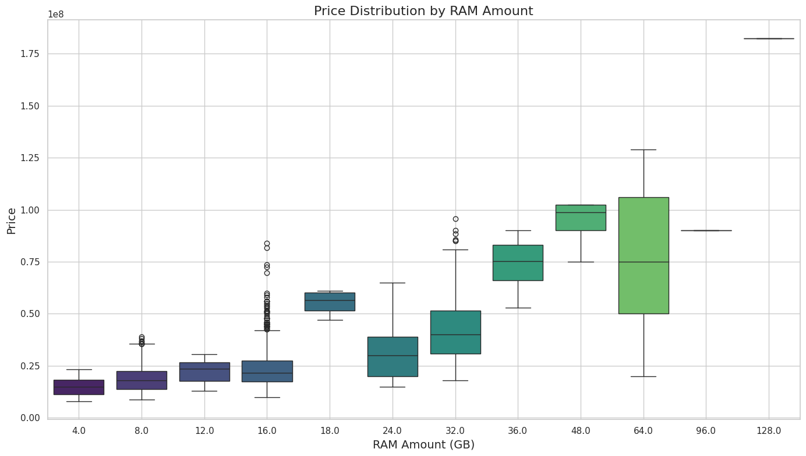

**Key Observations**:
- placeholder

**Conclusion**:
- placeholder


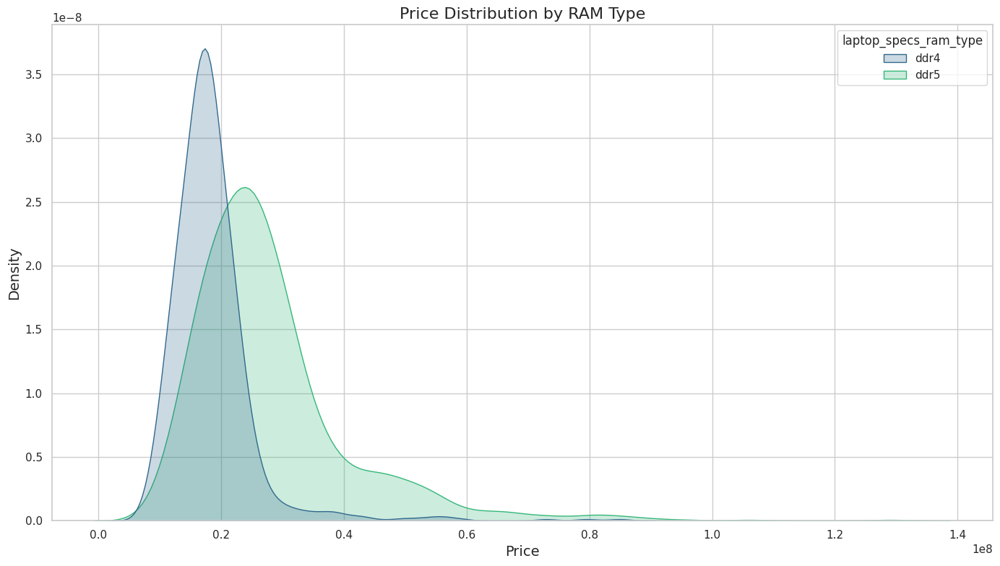

**Key Observations**:
- placeholder

**Conclusion**:
- placeholder

### 2.3.6 Storage

#### Basic analysis

```
Unique storage amounts and their counts:
laptop_specs_storage_amount
512.0     1227
1024.0     338
256.0      121
2048.0      14
8192.0       1
Name: count, dtype: int64

Unique storage types and their counts:
laptop_specs_storage_type
ssd    1636
hdd       6
Name: count, dtype: int64
```

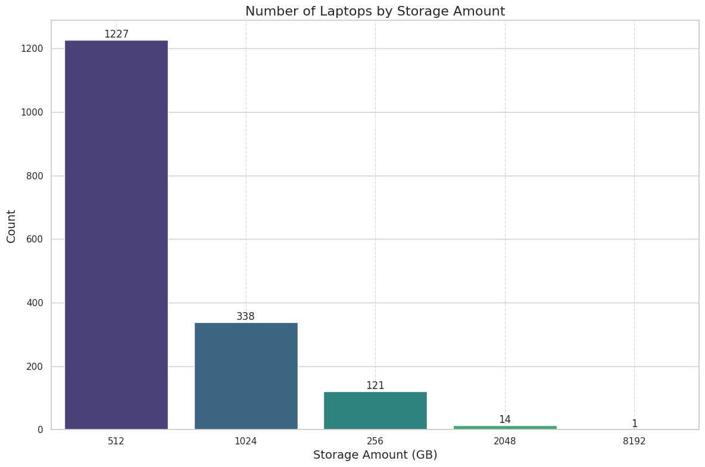

**Key Observations**:
- placeholder

**Conclusion**:
- placeholder

#### Analyzing Storage relation with price

```
Correlation between storage amount and price: 0.56
```

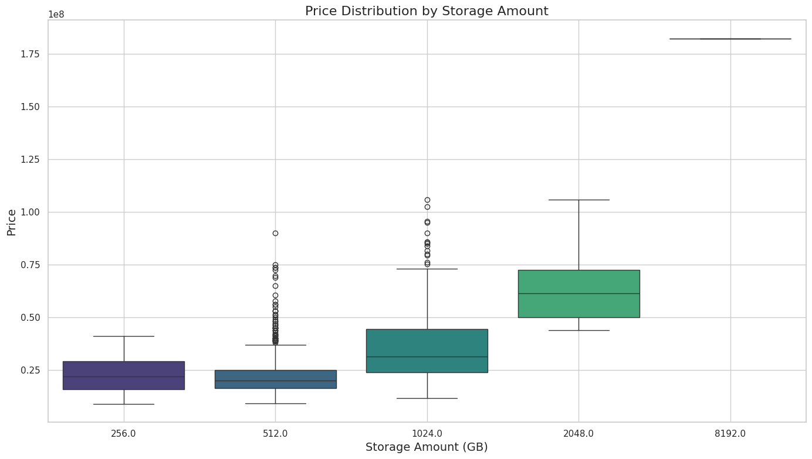

**Key Observations**:
- placeholder

**Conclusion**:
- placeholder

### 2.3.7 Screen Features

#### Basic analysis

```
Summary Statistics for Screen Size:
count    1707.000000
mean       14.971822
std         0.959482
min        13.000000
25%        14.000000
50%        15.600000
75%        15.600000
max        18.000000
Name: laptop_specs_screen_size, dtype: float64

Summary Statistics for Screen Refresh Rate:
count    1266.000000
mean      109.504739
std        47.309397
min        60.000000
25%        60.000000
50%       120.000000
75%       144.000000
max       480.000000
Name: laptop_specs_screen_refresh_rate, dtype: float64

Summary Statistics for Screen Brightness:
count    1148.000000
mean      333.719512
std       103.811275
min       220.000000
25%       250.000000
50%       300.000000
75%       400.000000
max      1200.000000
Name: laptop_specs_screen_brightness, dtype: float64
```

```
Unique screen resolutions and their counts:
laptop_specs_screen_resolution
1920x1080    978
1920x1200    406
2880x1800    156
2560x1600    144
3024x1964     31
2880x1864     29
2560x1664     21
2880x1920     16
2880x1620     13
3840x2400     12
2560x1644     12
3200x2000     12
3456x2234     11
2560x1440     10
2240x1400      7
3072x1920      6
2048x1280      6
1366x768       5
3456x2160      2
2960x1848      1
2220x1080      1
3201x2000      1
2256x1504      1
3000x2000      1
3840x2160      1
2160x1440      1
Name: count, dtype: int64
```

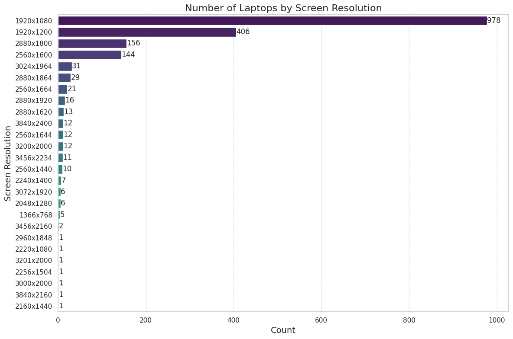

**Key Observations**:
- placeholder

**Conclusion**:
- placeholder

#### Analysis of screen features with price

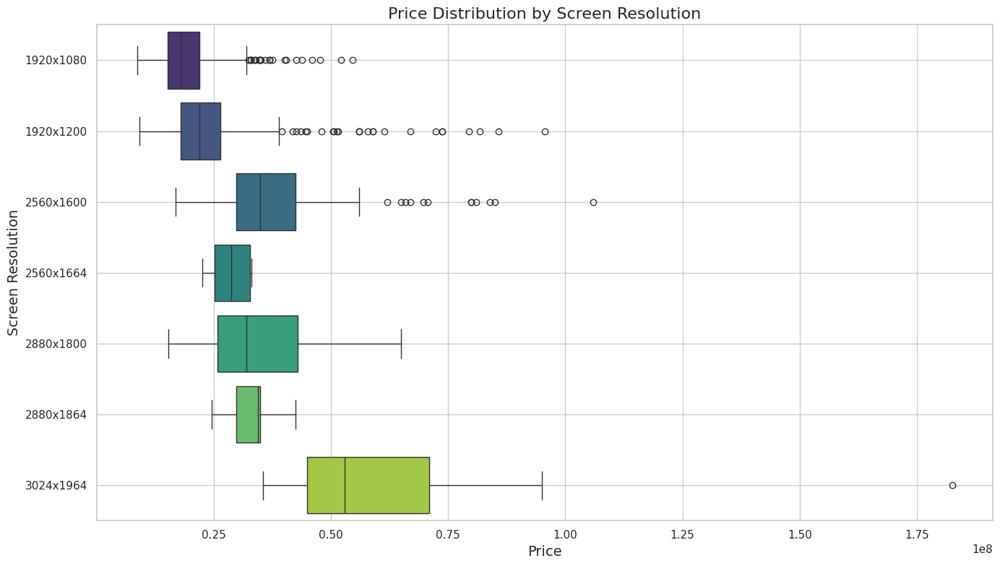

```
Correlation between screen size and price: 0.06
Correlation between screen refresh rate and price: 0.29
Correlation between screen brightness and price: 0.50
```

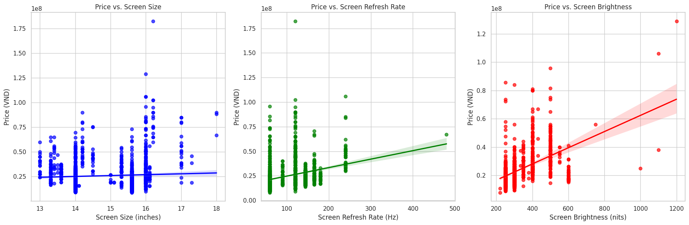

**Key Observations**:
- placeholder

**Conclusion**:
- placeholder

### 2.3.8 Portability Features

#### Weight

Basic analysis

```
Summary Statistics for Weight:
count    1577.000000
mean        1.728397
std         0.415082
min         0.879000
25%         1.400000
50%         1.650000
75%         2.000000
max         4.000000
Name: laptop_specs_weight, dtype: float64

```

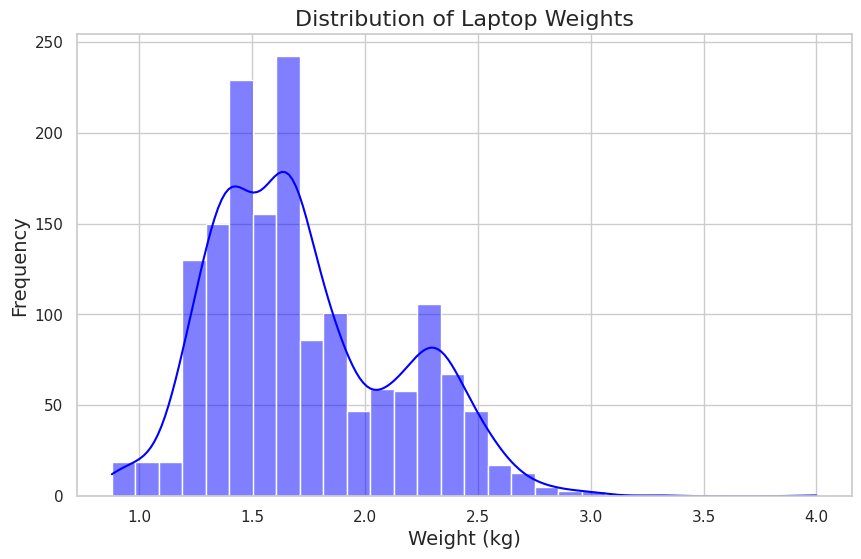

**Key Observations**:
- placeholder

**Conclusion**:
- placeholder

Analysis of weight with price

```
Correlation between weight and price: 0.17
```

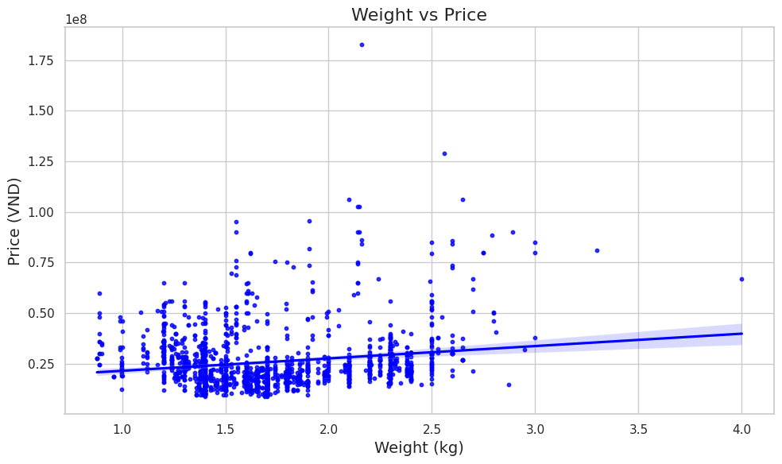

**Key Observations**:
- placeholder

**Conclusion**:
- placeholder

#### Length, Width, Height

Basic analysis

```
Summary Statistics for Length:
count    1498.000000
mean        1.907049
std         0.647121
min         0.930000
25%         1.690000
50%         1.830000
75%         1.990000
max        22.700000
Name: laptop_specs_height, dtype: float64

Summary Statistics for Width:
count    1498.000000
mean       34.120287
std         2.341405
min        28.700000
25%        31.560000
50%        35.610000
75%        35.940000
max        50.500000
Name: laptop_specs_width, dtype: float64

Summary Statistics for Height:
count    1498.000000
mean       23.461589
std         1.766152
min         3.000000
25%        22.100000
50%        23.500000
75%        24.770000
max        31.600000
Name: laptop_specs_depth, dtype: float64

```

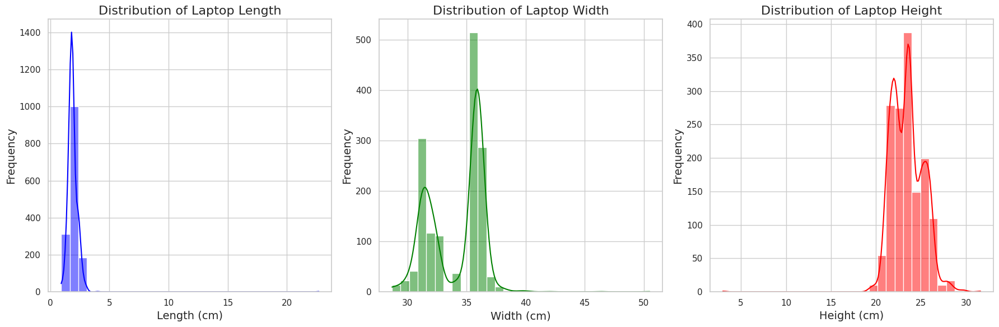

**Key Observations**:
- placeholder

**Conclusion**:
- placeholder

Analysis of dimensions with price

```
Correlation between length and price: -0.00
Correlation between width and price: -0.11
Correlation between height and price: 0.13

```

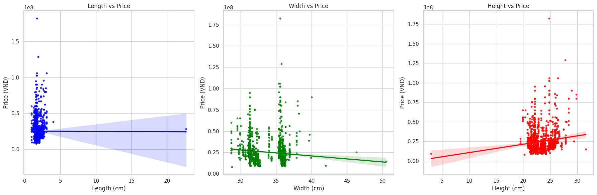

```
Correlation between volume and price: 0.03

```

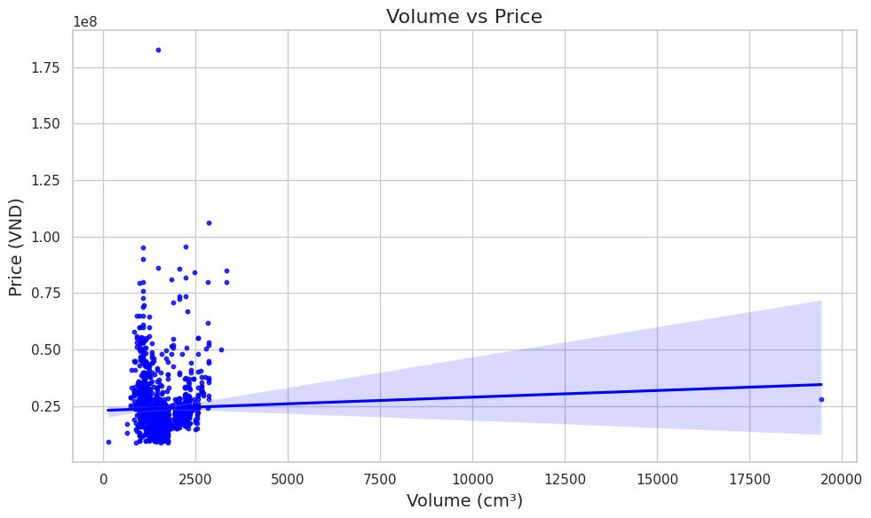

**Key Observations**:
- placeholder

**Conclusion**:
- placeholder

### 2.3.9 Battery and Power

#### Basic Analysis

```
Summary Statistics for Battery Capacity:
count    1707.000000
mean       58.177510
std        23.062029
min        36.000000
25%        47.000000
50%        55.000000
75%        65.000000
max       800.000000
Name: laptop_specs_battery_capacity, dtype: float64

Summary Statistics for Battery Cells:
count    1236.000000
mean        3.442557
std         0.653190
min         2.000000
25%         3.000000
50%         3.000000
75%         4.000000
max         6.000000
Name: laptop_specs_battery_cells, dtype: float64

```

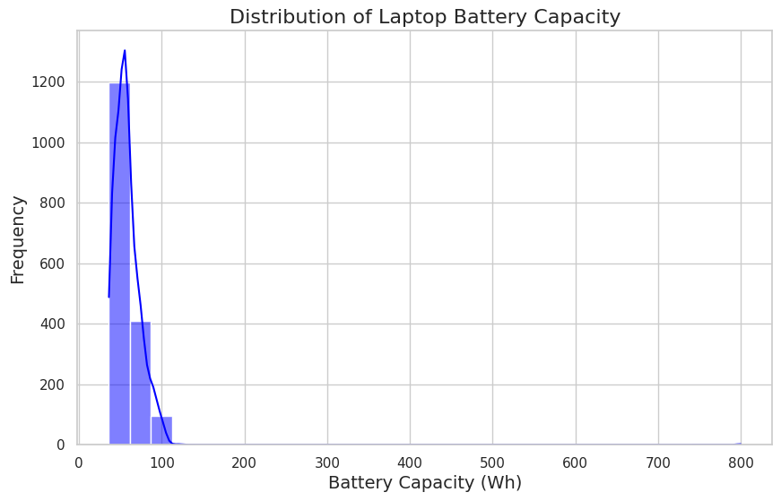

**Key Observations**:
- placeholder

**Conclusion**:
- placeholder

Analysis of battery and power features with price

```
Correlation between battery capacity and price: 0.44
Correlation between battery cells and price: 0.59

```

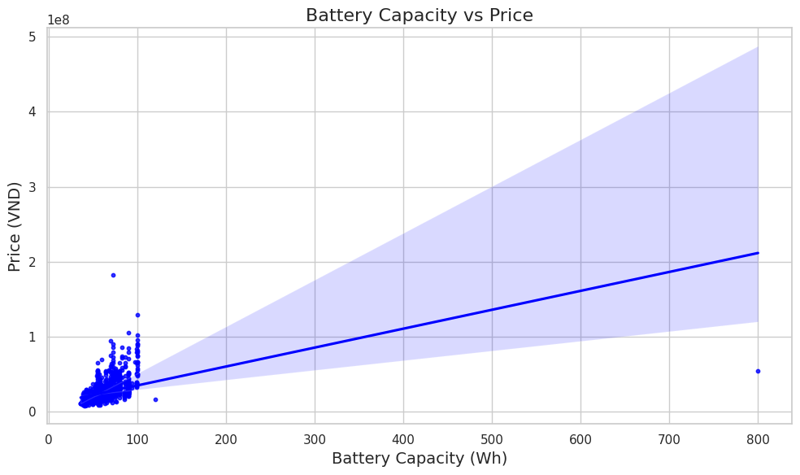

**Key Observations**:
- placeholder

**Conclusion**:
- placeholder

### 2.3.10 Connectivity Features

#### Basic analysis

```
Unique values and counts for number of USB-A ports:
laptop_specs_number_usb_a_ports
0.0     850
2.0     441
3.0     241
1.0     171
4.0      41
6.0       4
5.0       3
12.0      3
8.0       2
Name: count, dtype: int64

Unique values and counts for number of USB-C ports:
laptop_specs_number_usb_c_ports
1.0    831
2.0    411
0.0    404
4.0     50
3.0     32
8.0     22
5.0      6
Name: count, dtype: int64

Unique values and counts for number of HDMI ports:
laptop_specs_number_hdmi_ports
1.0    1517
0.0     239
Name: count, dtype: int64

Unique values and counts for number of Ethernet ports:
laptop_specs_number_ethernet_ports
0.0    1470
1.0     286
Name: count, dtype: int64

Unique values and counts for number of audio jacks:
laptop_specs_number_audio_jacks
0.0    1039
1.0     717
Name: count, dtype: int64
```

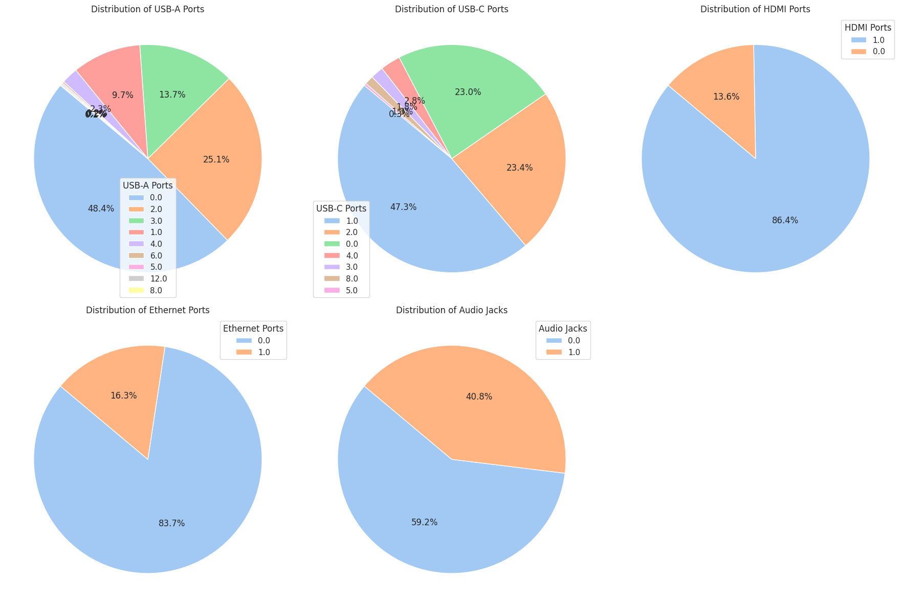

**Key Observations**:
- placeholder

**Conclusion**:
- placeholder

#### Analysis connectivity to price

```
Correlation between number of USB-A ports and price: -0.14
Correlation between number of USB-C ports and price: 0.00
Correlation between number of HDMI ports and price: -0.18
Correlation between number of Ethernet ports and price: -0.04
Correlation between number of audio jacks and price: 0.03
```

**Key Observations**:
- placeholder

**Conclusion**:
- placeholder

### 2.3.11 Software Features

#### Default OS

Basic analysis

```
Unique OS and their counts:
laptop_specs_default_os
windows      1703
macos         140
linux          30
chrome os       2
Name: count, dtype: int64

```

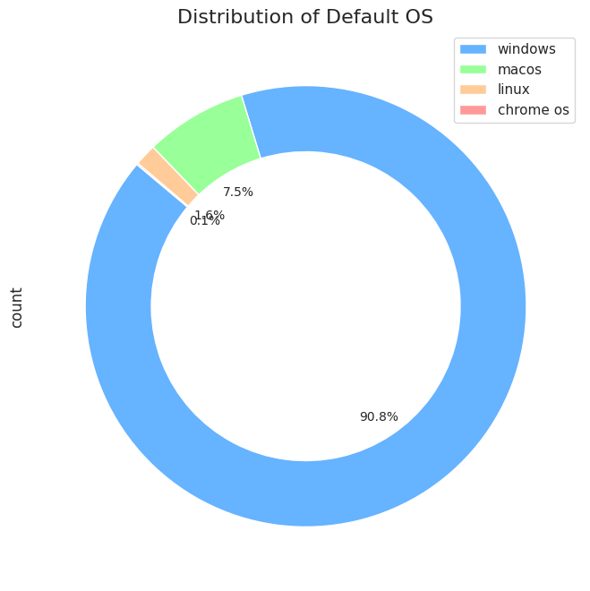

**Key Observations**:
- placeholder

**Conclusion**:
- placeholder

#### Warranty

```
Unique warranty values and their counts:
laptop_specs_warranty
12.0    851
24.0    765
36.0     76
18.0      1
Name: count, dtype: int64

```

```
Correlation between warranty and price: 0.05

```

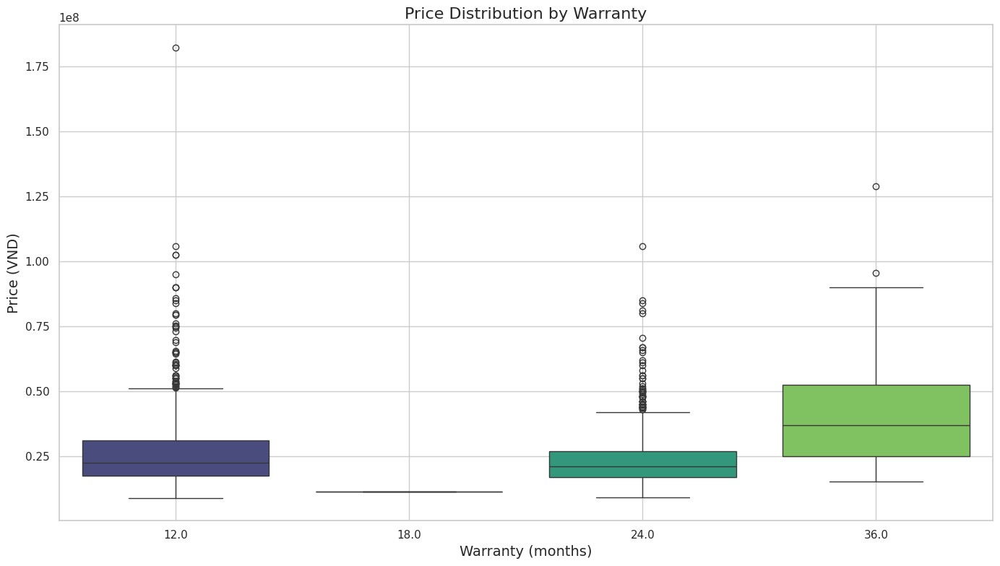

**Key Observations**:
- placeholder

**Conclusion**:
- placeholder

### 2.3.12 Target Feature: price

Basic statistics

```
Basic Statistics for Price:
count    1.959000e+03
mean     2.532114e+07
std      1.386554e+07
min      7.890000e+06
25%      1.699000e+07
50%      2.189000e+07
75%      2.939000e+07
max      1.824900e+08
Name: laptop_specs_price, dtype: float64

```

Visualizing the distribution

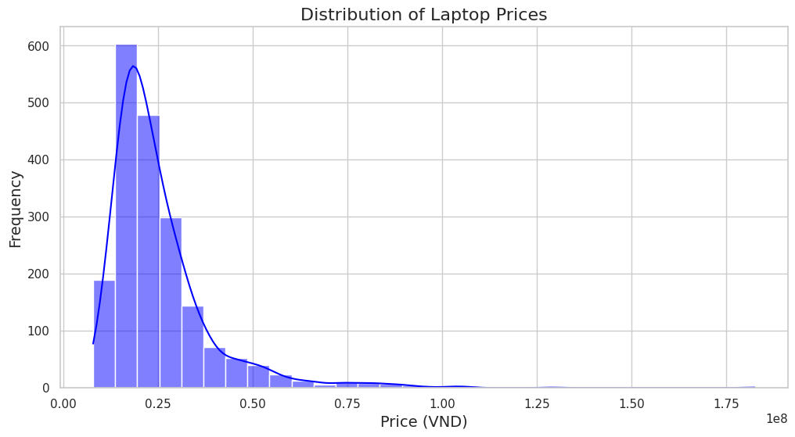

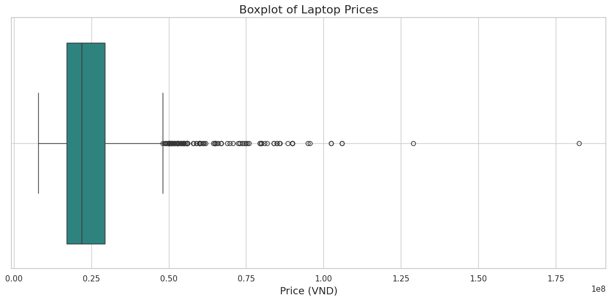

**Key Observations**:
- placeholder

**Conclusion**:
- placeholder
